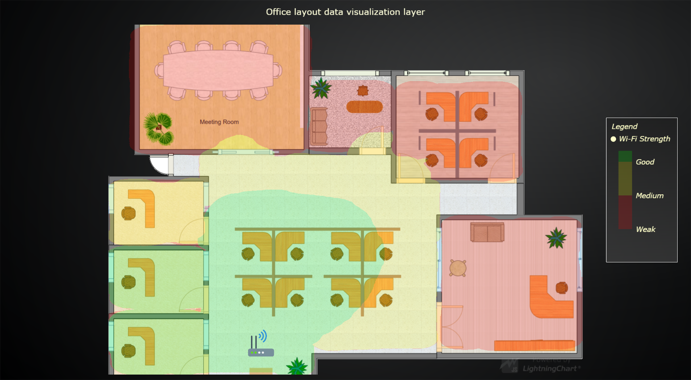

# JavaScript Office Layout Data Visualization Chart



This demo application belongs to the set of examples for LightningChart JS, data visualization library for JavaScript.

LightningChart JS is entirely GPU accelerated and performance optimized charting library for presenting massive amounts of data. It offers an easy way of creating sophisticated and interactive charts and adding them to your website or web application.

The demo can be used as an example or a seed project. Local execution requires the following steps:

- Make sure that relevant version of [Node.js](https://nodejs.org/en/download/) is installed
- Open the project folder in a terminal:

        npm install              # fetches dependencies
        npm start                # builds an application and starts the development server

- The application is available at *http://localhost:8080* in your browser, webpack-dev-server provides hot reload functionality.


## Description

Example showcasing LightningChart JS capabilities with external pictures.

This example takes place in the context of data visualization in office premises.
For this purpose, the series area is styled by a digital picture of the office layout.

In code, this is implemented by loading the `Image` (in this case PNG file), and creating a new `ImageFill` object using that image.
While it might not be obvious from looking at it, the chart type used in this example is a `ChartXY`.
The picture is shown by configuring the fill style of the series background.

```ts
const image = new Image()
image.src = 'office-layout.png'

const imageFill = new ImageFill({ source: image })

chart.setSeriesBackgroundFillStyle(imageFill)
```

Once, the `ChartXY` is laid over the office layout, any of the numerous data visualization features of the chart type can be used to add detail to the chart.

In this case, we used a `Heatmap Series` to display the distribution of WiFi strength across the entire office, where the data values are distributed to 4 categories (No measurement, Weak, Medium and Good).

## Adding Icons to LightningCharts

Additionally, this example showcases how icons can be used inside charts.
The example uses this by displaying the WiFi router location as a picture of a router device (bottom of chart).

This is achieved similarly to the office layout picture by utilizing `ImageFill`.
However, this time instead of styling the series background, an `UIElement` is created and the image is attached to its background.

```ts
const uiIcon = chart.addUIElement()
    .setBackground(background => background
        .setFillStyle(imageFill)
    )
    // Icon size is controlled using padding.
    .setPadding({ left: widthPx, top: heightPx })
    .setText('')
```

[Office layout picture](https://www.edrawsoft.com/template-colored-office-layout.html) by [Edraw](https://www.edrawsoft.com)

## API Links

* [XY cartesian chart]
* [Axis]
* [Legend box]
* [Image fill style]
* [Heatmap grid series]
* [UI text box]


## Support

If you notice an error in the example code, please open an issue on [GitHub][0] repository of the entire example.

Official [API documentation][1] can be found on [Arction][2] website.

If the docs and other materials do not solve your problem as well as implementation help is needed, ask on [StackOverflow][3] (tagged lightningchart).

If you think you found a bug in the LightningChart JavaScript library, please contact support@arction.com.

Direct developer email support can be purchased through a [Support Plan][4] or by contacting sales@arction.com.

[0]: https://github.com/Arction/
[1]: https://www.arction.com/lightningchart-js-api-documentation/
[2]: https://www.arction.com
[3]: https://stackoverflow.com/questions/tagged/lightningchart
[4]: https://www.arction.com/support-services/

© Arction Ltd 2009-2020. All rights reserved.


[XY cartesian chart]: https://www.arction.com/lightningchart-js-api-documentation/v3.3.0/classes/chartxy.html
[Axis]: https://www.arction.com/lightningchart-js-api-documentation/v3.3.0/classes/axis.html
[Legend box]: https://www.arction.com/lightningchart-js-api-documentation/v3.3.0/classes/chartxy.html#addlegendbox
[Image fill style]: https://www.arction.com/lightningchart-js-api-documentation/v3.3.0/
[Heatmap grid series]: https://www.arction.com/lightningchart-js-api-documentation/v3.3.0/
[UI text box]: https://www.arction.com/lightningchart-js-api-documentation/v3.3.0/

